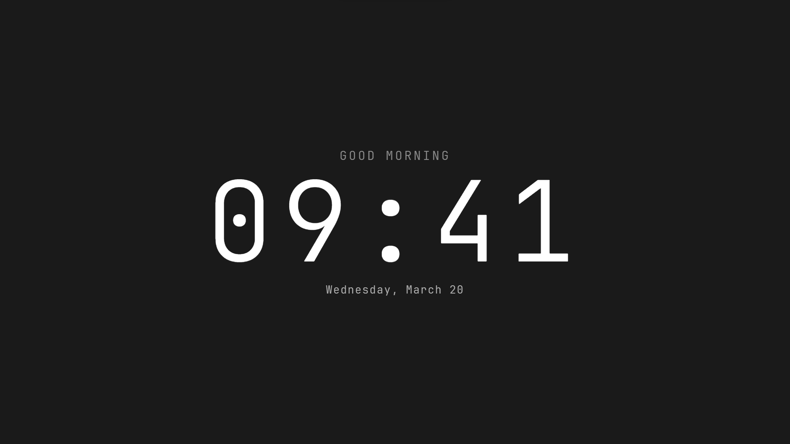

# Minimal Clock - New Tab Extension

Minimalist Chrome new tab page featuring a beautiful JetBrains Mono digital clock with smart features.



## ✨ Features

- 🕐 **Large Digital Clock** - Beautiful JetBrains Mono font with HH:MM format
- 🌅 **Time-based Greetings** - Good Morning/Afternoon/Evening/Night
- 📅 **Date Display** - Current day and date in elegant typography
- ⚡ **Lightning Fast** - Instant load with 0.2s fade-in animation
- 📱 **Fully Responsive** - Perfect on all screen sizes and orientations
- ⌨️ **Keyboard Shortcuts** - Power user features
- 🎨 **Minimalist Design** - Clean, distraction-free interface
- 🚫 **Non-selectable** - Clean interaction without text selection
- 🔧 **Manifest V3** - Latest Chrome extension standards

## ⌨️ Keyboard Shortcuts

- **Space** - Hide/show clock (focus mode)
- **D** - Toggle date and greeting display
- **F** - Toggle fullscreen mode
- **? or /** - Show shortcuts hint

## 🚀 Installation

### Chrome / Edge / Brave

1. **Open Extensions Page**:
   - **Chrome**: Go to `chrome://extensions/`
   - **Edge**: Go to `edge://extensions/`
   - **Brave**: Go to `brave://extensions/`

2. **Enable Developer Mode** - Toggle the switch in top right

3. **Load Extension** - Click "Load unpacked" and select this folder

4. **Open New Tab** - Press Ctrl+T to see your beautiful minimal clock

### Alternative Method (All Browsers)
- Download the latest release zip file from [Releases](https://github.com/mosaddiqdev/new-tab/releases)
- Extract the zip file to a folder
- Follow steps 1-4 above

## 🎨 Design Philosophy

- **Minimal** - Only essential elements, no clutter
- **Fast** - Instant loading, no delays or heavy animations
- **Clean** - JetBrains Mono typography, perfect spacing
- **Smart** - Time-aware greetings, responsive design
- **Focused** - Distraction-free environment for productivity

## File Structure

```
new-tab/
├── manifest.json       # Extension configuration (Manifest V3)
├── newtab.html        # New tab page HTML
├── styles.css         # Dark minimalistic styling
├── clock.js           # Clock functionality and interactions
├── fonts/             # JetBrains Mono font files
├── icons/             # Extension icons
└── README.md          # This file
```

## Customization

- **Colors**: Edit `styles.css` to change the color scheme
- **Content**: Modify `newtab.html` to add more features
- **Icons**: Replace placeholder icons in the `icons/` folder

## Troubleshooting

- **Extension not loading**: Check the console in `chrome://extensions/` for errors
- **New tab not changing**: Make sure the extension is enabled and refresh Chrome
- **Styling issues**: Check that `styles.css` is properly linked in `newtab.html`
